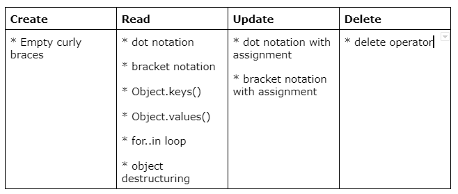

# Dynamic Object Manipulation

In JavaScript, you can create, read, update and remove properties from an object in multiple ways. Here are some "tried-and-true" approaches for each operation:



## 1) Create an object

You can initialize an object by declaring empty curly braces.

```js
let obj = {}
```

## 2) Reading an object

* Read a single object property value using dot notation

    ```js
    let student = {
        name: 'Rado',
        grade: 85,
        isMale: true
    }
    
    student.name

    // returns 'Rado'
    ```

* Read a single object property value using bracket notation

    ```js
    let student = {
        name: 'Rado',
        grade: 85,
        isMale: true
    }
    
    student['name']
    
    // returns 'Rado'
    ```

* Read all object properties using `Object.keys()`

    ```js
    let student = {
        name: 'Rado',
        grade: 85,
        isMale: true
    }

    Object.keys(student)
    
    // returns ['name', 'grade', 'isMale']
    ```

* Read all object property values using `Object.values()`

    ```js
    let student = {
        name: 'Rado',
        grade: 85,
        isMale: true
    }

    Object.values(student)
    
    // returns ['Rado', 85, true]
    ```

* Read all property names and values in an object using a `for..in` loop

    ```js
    let student = {
        name: 'Rado',
        grade: 85,
        isMale: true
    }

    for ( let property in student) {
        student[property] = null;
    }

    //  student now equals { name: null, grade: null, isMale: null }
    ```

* Read all property values in an object by destructing it's properties

    ```js
    let student = {
        name: 'Rado',
        grade: 85,
        isMale: true
    }

    const { name, grade, isMale } = student;

    // Newly declared variable "grade" equals 85
    ```

## 3) Update an object

* Add a single property name to an object using bracket notation

    ```js
    let student = {
        name: 'Rado',
        grade: 85,
        isMale: true
    }

    student['age'] = null

    // student now equals { name: 'Rado', grade: 85, isMale: true, age: null }
    ```

* Update a single property value using bracket notation

    ```js
    let student = {
        name: 'Rado',
        grade: 85,
        isMale: true
    }

    student['grade'] = 50

    // student now equals { name: 'Rado', grade: 50, isMale: true}
    ```

## 4) Remove properties from an object

* Remove a single property from an object using the `delete` operator

    ```js
    let student = {
        name: 'Rado',
        grade: 85,
        isMale: true
    }

    delete student['name']

    // student now equals { grade: 85, isMale: true}
    ```
